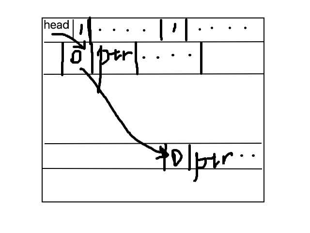

# tinydbpp
A simple single user, single thread, file-based SQL database implemented in C++ for *nix.

## Dependencies
  - cmake 2.8+
  - gcc 4.8+
  - boost 1.54+
  - pthread
  - QT5+

## Build

```bash
  # Download third party libraries
  git submodule init --recursive --update
  # This could be any directory
  BUILD_DIR=./build
  mkdir -p $BUILD
  cd $BUILD
  cmake $PROJECT_DIR
  make -j8

  # To run a test
  test/testXXX

  # To run Command line interface
  src/cli
  # To run graphical user interface
  gui/tinydbpp-gui/tinydbpp-gui
```

## Design
Tinydbpp is designed as multiple layers(like SQLite)
Each layer depends only on its lower layers.


Main goals for each layer.
#### Pager
Provide a pager with which user can transparently CRUD(create/read/update/delete) a cached page.
  - 功能: 实现了一个基于文件的页式储存系统, 给定一个文件, 如果不存在则自动创建, 可以得到一个Pager对象, 通过Pager对象
    可以访问某个页. 实现了页缓存, 当缓存已满的时候, 采用FIFO页替换算法.
  - 基本参数
    - 页大小 4096B
    - Cache 大小 10K页
Sample:
```c++
  Pager *pPager = new Pager("/tmp/testFile123", Pager::OpenFlag::ReadWrite);
  shared_ptr<Page> pPage = pPager->getPage(0);
  char *pBuf = pPage->getBuf();
  pBuf[0] = 'A';
  pPage->markDirty();
  pPage->releaseBuf(pBuf);

  pPager->
  delete pPage;
  }

```


#### Record
Provide APIs for basic operations on a record. The Record are categoried as "fixed" and "not-fixed", which means whether it contains a "varchar" column and the length of the data in the column is longer than DEFAULT_VARCHAR_LEN.
##### Storage Structure
- Page(0) in a file, which represents a table, records the schema of the table.
- Page(1), Page(4098), Page(4097k + 1) is dictionary pages. 4097 pages is an extent. Every bytes in the dictionary page records the state (is fixed? is full?...) of its relevant data page.
- Fixed pages use a linked list to record the blank places. This method can help us insert a record into a page quickly.

- Not-fixed pages use a relatively simple structure. A length of record is saved ahead.
- More details are in [Model.md](Model.md).
##### Basic Operation
- Insert. Inserting an "item" into table must specified "fixed" or "not-fixed", we will find a blank page to record and return the location.  
- Update. This method takes lambda functions "Changer" and "Checker" as parameters. Checker can tell us whether the record should be updated meanwhile the "Changer" can update an item. This method will scan all the tables to get results.
- UpdateOneRecord. Update the record at given location.
- Delete. This method takes lambda functions "Solver" and "Checker" as parameters. Checker can tell us whether the record should be deleted meanwhile the "Solver" can deal with the selected items for example collecting. This method will scan all the tables to get results.
- DeleteOneRecord. Delete the record at given location.
- Select. This method takes lambda functions "Solver" and "Checker" as parameters. Checker can tell us whether the record should be selected meanwhile the "Solver" can deal with the selected items for example collecting. This method will scan all the tables to get results.
- SelectOneRecord. Select the record at given location.
#### BTree
  - 功能: 实现了一个基于 RecordManager 的 B+ 树, B+ 树的关键码类型为模板参数, 可以由用户编译时指定,
    B+ 树的数据为 Location 结构体, 即指向文件某个地址的指针.
  - 由于 B+ 树不允许有重复关键码, 而数据库索引可以有重复, 基于 B+ 树又实现了一个带重复关键码的 B+ 树.
    实现方式是在 B+ 树的数据 Location 指向的地址保存一个 Location 数组, Location 数组这条记录是
    变长数据, 所以可以对应多条记录. 添加, 删除都相当于原 B+ 树的更新操作, 根据关键码查找的操作应该先根据关键码
    查找 Location 数组, 再遍历 Location 数组, 找到这条记录.

#### TableManager
This layer is responsible for manage databases and tables. Nevertheless, it encapsulate operations on records and index.
##### Entities Identification
We use a low-coupling method the identify databases, tables, and index. Every database is a directory and every table is a file. The files named `(.+)\.(.+)` will be recognized as an index file.

Every time the program is started, it will scan the directory's structure and identifies these entities's information.
##### Table Operations
A Class `TableDescription` records tables' schema and encapsulate table's operations. Some extra functions of the system such as `foreign key's constrain、propreties' constrain ` are implemented in this layer. When we insert or update in a table, we should check foreign key's tables for feasibility.
- embed. Embed a list of properties into a binary string.
- read. Expand a binary string to a list of properties.
- InsertInTable. All kinds of constrains are taken into consideration.
- UpdateItems.
- SelectUseIndex.
- SelectUseChecker.
- DeleteAndCollectItemsUseIndex.
- DeleteAndCollectItemsUseChecker.

#### Parser
This layer is responsible for parsing the query string and dealing with the query.
##### Flex & Bison
We use Flex and Bison to do lexical analysis and grammatical analysis.
##### Query
The class `Statement` has a property `type` to represent its query type. Virtual function `exec` will execute the statement.
- Selection optimization is based on the principle `using index as possible`. We consider many situations such as `table1.col1 = table2.col1` and one of them has index or there's other constrains which can not use index but once enumerating this column, another column can use index and so on ...
- Multiple tables joining is supported by implementing a `DFS` based selection method. We recursively find out which table should be enumerated or selected using index and assign the value to get a new `WhereClause` and new `Checker`.
- Approximate matching.（模糊查询 LIKE 关键字）
  - 实现方法: 首先将查询关键字中非字符, 数字, '%'和'_'的其他符号前面全部加一个 '\' 转移符, 再将 '\_' 替换成 '.',将 '%' 替换成 '.*', 接下来用 C++ 的 regex 库进行正则表达式匹配.

#### GUI
  - 采用 QT 实现, 将 tinydbpp 作为静态库和 QT 实现的 GUI 程序一起链接, tinydbpp 提供执行 SQL 语句的接口, 返回值为 JSON。
  - QT 这边解析 JSON 根据执行不同的语句选择是显示成表格, 还是显示提示信息.
####Work Division
- 丁铭负责了记录管理模块、系统管理模块和大部分查询解析模块代码和小部分测试代码。
- 王奥丞负责底层页式文件系统、索引模块、图形化界面、小部分查询解析模块代码和大部分测试代码。

### Reference
[1] Sqlite官方文档[https://www.sqlite.org/docs.html]